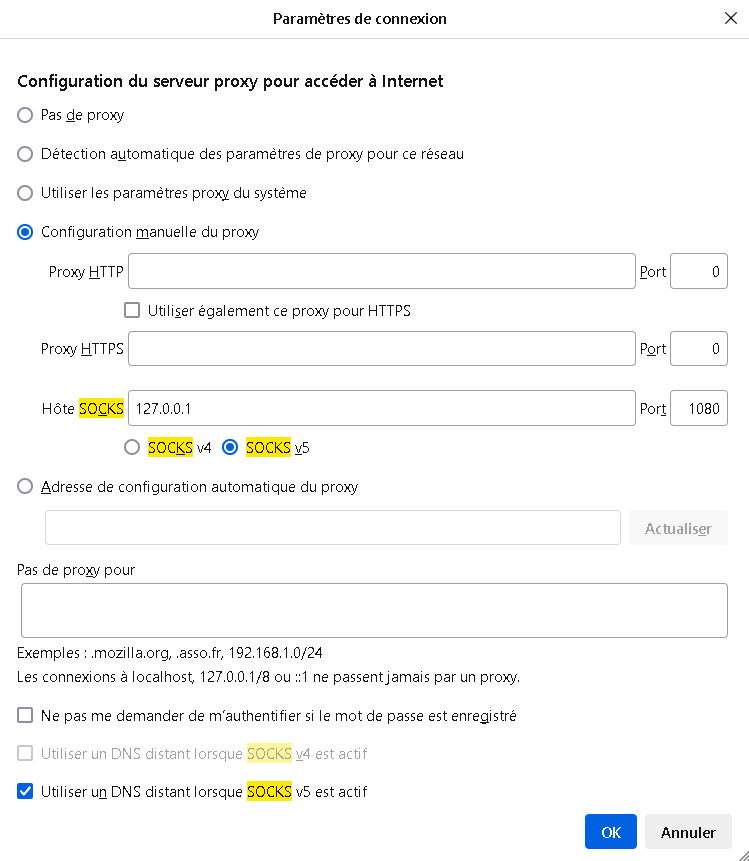

# Serveur Proxy SOCKS v5

# Sommaire

1. [Description du projet](#1-description-du-projet)
   - [Fonctionnalités principales](#fonctionnalités-principales)

2. [Méthodes d'utilisation](#2-méthodes-dutilisation)
   - [Prérequis](#prérequis)
   - [Installation de ASIO](#installation-de-asio)
   - [Utilisation sous Windows](#utilisation-sous-windows)
     - [Étapes de compilation](#étapes-de-compilation)
     - [Exécution](#exécution)
   - [Utilisation sous Linux](#utilisation-sous-linux)
     - [Étapes de compilation](#étapes-de-compilation-1)
     - [Exécution](#exécution-1)

3. [Configuration du navigateur](#configuration-du-navigateur)
   - [Firefox](#firefox)
   - [Chrome](#chrome)

4. [Installation de CMake sur CMD (Windows)](#installation-de-cmake-sur-cmd-windows)

5. [Exemple d'utilisation](#exemple-dutilisation)


## 1. Description du projet

Ce projet implémente un serveur proxy SOCKS v5 conformément à la [RFC 1928](https://www.rfc-editor.org/rfc/rfc1928). Le serveur supporte uniquement la commande `CONNECT` et n'exige aucune authentification. Il permet de relier un client SOCKS à une destination réseau via un pivot SOCKS, assurant une communication bidirectionnelle concurrentielle entre le client et le serveur distant.

### Fonctionnalités principales
- Gestion des connexions SOCKS v5.
- Support des adresses IPv4 et des noms de domaine pour la commande `CONNECT`.
- Communication bidirectionnelle entre le client et le serveur distant.
- Concurrence pour les connexions multiples.

L'outil est conçu pour être utilisé comme proxy avec des navigateurs web tels que **Firefox** ou **Chrome**.

---

## 2. Méthodes d'utilisation

### Prérequis
- **CMake** (version 3.10 ou supérieure).
- **Compilateur compatible C++20**.
- Bibliothèque **ASIO** (version 1.30.2 utilisée dans ce projet).

### Installation de ASIO
- Téléchargez la bibliothèque ASIO depuis [Boost.org](https://think-async.com/Asio/).
- Extrayez les fichiers et placez-les dans un répertoire adjacent au projet. Assurez-vous que le chemin est correctement défini dans `CMakeLists.txt`.

---

### Utilisation sous Windows

#### Étapes de compilation
1. Ouvrez une invite de commande
2. Placer vous dans le dossier SOCKS_V5
3. Exécutez les commandes suivantes :
```bash
mkdir build
cd build
cmake ../challenge_socks
cmake --build .
```

4. L'exécutable sera généré dans le répertoire `build\Debug`.

Si vous n'avez pas installé CMake sur Windows, veuillez-vous référer à cette section : `[Installation de CMake sur CMD (Windows)]`

#### Exécution
Pour démarrer le serveur, exécutez la commande suivante :

Sous **Windows** :
```bash
build\challenge_socks.exe
```

### Utilisation sous Linux

#### Étapes de compilation
1. Installez les outils nécessaires (si non déjà installés) :
```bash
sudo apt update
sudo apt install build-essential cmake
```

2. Exécutez les commandes suivantes dans un powershell:
 ```bash
mkdir build
cd build
cmake ..
make
```

3. L'exécutable sera généré dans le répertoire `build\Debug`.

#### Exécution

Lancez l'exécutable généré :
 ```bash
./build/challenge_socks
```

Le serveur sera disponible sur `127.0.0.1:1080`


### Configuration du navigateur

#### Firefox

1. Ouvrez Firefox et accédez à Paramètres > Général > Paramètres réseau.
2. Sélectionnez Configuration manuelle du proxy.
3. Dans la section SOCKS Host, entrez 127.0.0.1 et 1080 comme port.
4. Assurez-vous que SOCKS v5 est sélectionné.

Votre configuration firefox devrait ressemblé à ceci :



#### Chrome

1. Ouvrez Google Chrome. dans Paramètres de Chrome > Avancé > Système > Ouvrez les paramètres de proxy de votre ordinateur. 
de votre ordinateur. ( ou copiez simplement ce lien : chrome://settings/system)
2. Modifiez vos paramètres de proxy.
3. Cliquez sur OK.
4. Sélectionnez Appliquer.


## Installation de CMake sur CMD (Windows)

### Étapes d'installation

1. **Télécharger CMake**  
   Rendez-vous sur le site officiel :  
   [https://cmake.org/download/](https://cmake.org/download/)

2. **Installer CMake**  
   - Téléchargez l'installateur pour Windows (fichier `.msi`).  
   - Lancez l'installateur et suivez les étapes.  
   - Pendant l'installation, cochez l'option **"Add CMake to the system PATH for all users"**.

3. **Vérifier l'installation**  
   - Ouvrez l'invite de commande (`cmd`).  
   - Tapez la commande suivante :  
     ```bash
     cmake --version
     ```  
   - Si CMake est correctement installé, vous verrez une version comme ceci :  
     ```
     cmake version 3.x.x
     ```

## Exemple d'utilisation

Une fois le serveur en cours d'exécution, configurez votre navigateur pour utiliser le proxy et testez l'accès à un site web (par exemple, https://www.lemonde.fr).


